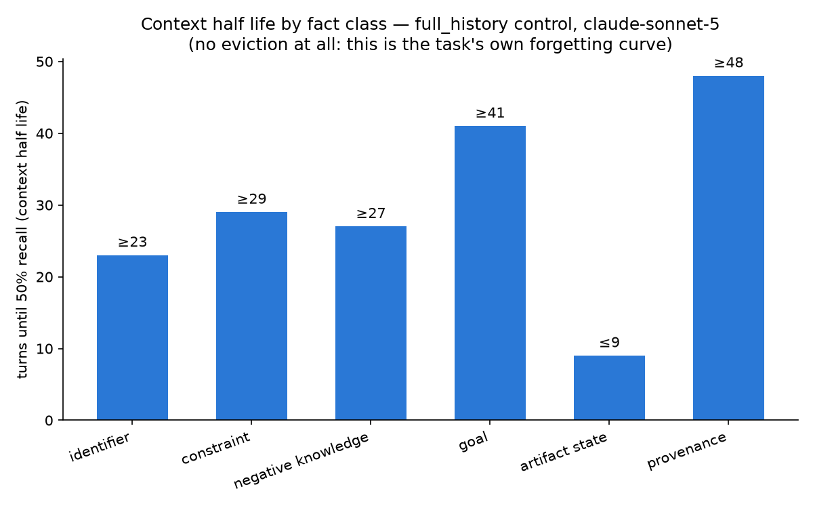
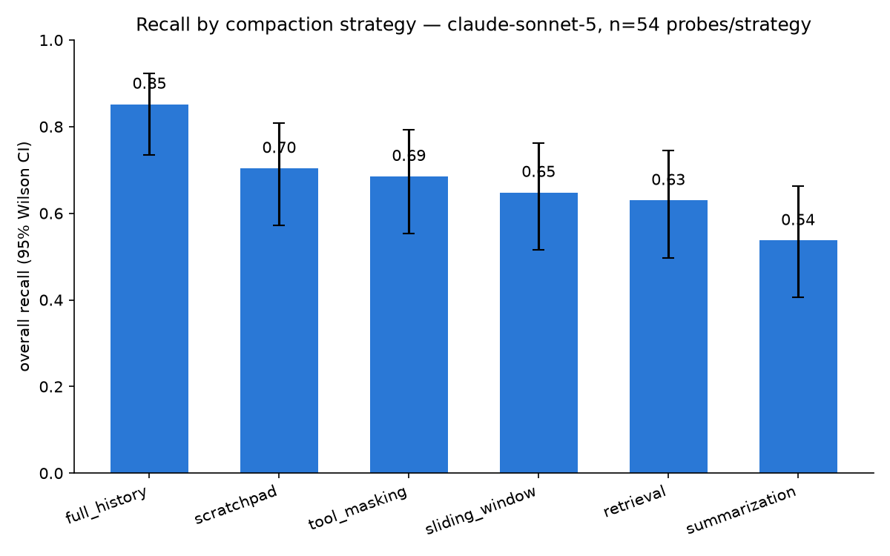
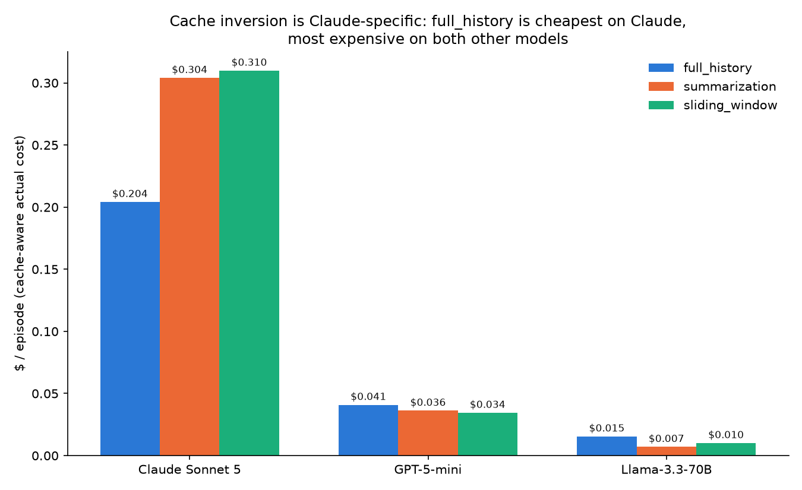

# goldfish: how fast does an agent forget, and what does remembering cost?

## The problem

Long-running AI agents run out of context. When they do, something in the
conversation has to be evicted, summarized, or otherwise thrown away — a
process usually called "context compaction." Several strategies for doing
this are in common use (drop the oldest turns, summarize them, mask old tool
output, let the agent keep its own notes, retrieve relevant turns on demand),
and the standard justification for using any of them is that they save
tokens, which saves money.

Nobody had actually measured, with controlled conditions and real models,
*which kind of information* each strategy destroys, *how fast*, or whether
the cost story is even true. This project is that measurement.

## Method

A synthetic agentic task (closing out a ledger of pending transactions)
has six categories of fact planted into it at known points in the
conversation — an account identifier, a policy constraint, something the
agent must *not* do, the episode's stated goal, the current state of an
artifact it's manipulating, and where a fact originally came from. Later in
the same episode, probes ask the agent to recall each fact, and answers are
graded three ways, not two:

| outcome | meaning |
| --- | --- |
| `recalled` | correct |
| `admitted` | wrong, and the agent said so |
| `hallucinated` | wrong, stated with confidence |

The three-way split matters because "the agent forgot" and "the agent forgot
and made something up instead" are operationally very different failures.

Before trusting any result, the harness itself is checked against two
invariants: the control strategy (`full_history`, i.e. never evict anything)
must score a near-ceiling recall, and every strategy must be byte-identical
to the control at an unbounded budget. Both have already caught real bugs —
see the commit history and README for specifics.

7 strategies were implemented behind one common interface
(`full_history`, `sliding_window`, `tool_masking`, `retrieval`,
`summarization`, `scratchpad`, `structured_notes`), run against Claude
Sonnet 5, GPT-5-mini, and Llama-3.3-70B (the last two via OpenRouter),
with Wilson-score confidence intervals throughout, since much of the data
sits at exactly 0/n or n/n recall where a normal-approximation interval
gives a nonsensical answer.

## Findings

### 1. Memory loss is class-specific, not a single number

<p align="center"></p>

Even under the control strategy — full history, nothing evicted at all —
`artifact_state` (what the agent has already done) has a context half life
under 9 turns. `constraint` and `goal` never dropped below 50% recall within
the ~30-48 turns tested, under any strategy. This is the strongest, most
consistent signal in the dataset: the task itself, not any compaction
strategy, is what makes an agent lose track of state. Any compaction
strategy makes this worse; none of them are the root cause.

### 2. Recall ranking, across strategies

<p align="center"></p>

`full_history` recalls best (0.85), `summarization` worst (0.54), with the
other four strategies clustered in between. Admission rate was 0.00 across
every episode in the primary dataset — the model was never once honestly
"I don't know"; every miss was a confident wrong answer.

### 3. The cost story is real, but it's Claude's story, not a universal one

<p align="center"></p>

On Claude, `full_history` is the *cheapest* strategy per episode ($0.20 vs.
$0.30-0.31 for compacting strategies), because Claude's prompt cache benefit
ratio for `full_history` is 2.2x versus only 1.3-1.4x for any strategy that
rewrites history — every compaction invalidates the cached prefix and forces
a full reprocess. This inverts the standard "compact to save money"
assumption.

Run the identical comparison on GPT-5-mini and Llama-3.3-70B (12 episodes,
$0.29 total, via OpenRouter) and the direction reverses: `full_history` is
the **most** expensive strategy per episode on both. Caching still helps on
these models (1.0-1.3x vs. an uncached counterfactual) but not enough to
overcome the raw token-volume cost of never evicting anything.

**Conclusion:** the cache-inversion finding is a fact about Claude's
specific prompt-caching economics, not a universal law of context
compaction. That's a more defensible, more interesting claim than "compact
to save money" or its inverse — and it's a claim this project can make
precisely because it tested more than one model, which is exactly what a
single-model study can't do.

The recall *ranking* (full_history best, summarization worst) did hold up
directionally on both new models, at much smaller n (12 probes per
model x strategy cell, wide overlapping confidence intervals) — read that
part as suggestive, not confirmed.

## What didn't pan out (reported, not hidden)

A separate study attempted to answer whether recall loss compounds linearly
across repeated compactions or fails abruptly past some threshold. The
instrumentation was built and run, but the result was a methodological
finding rather than an answer: because each probe class is tested once at a
fixed point in the episode, "which compaction generation a probe lands on"
turned out to be almost perfectly correlated with "which fact class is being
tested," confounding the two. A genuine answer needs a probe design that
re-tests the *same* fact across multiple compaction generations — flagged
here as real future work rather than papered over with a false curve.

## Limitations

- One synthetic task domain. Deliberately so — a single controlled
  environment is what makes the probe methodology valid; a second task
  domain is real, legitimate future work (see below), not a gap in this
  study.
- The multi-model leg is a coverage check (12 episodes), not a full
  replication of the 54-episode Claude matrix — sized to answer "does the
  ranking/cost-inversion direction generalize," not to produce per-model
  half-life curves with the same precision as the Claude data.

## Reproduce it

```bash
python -m pytest                                       # instrument + metrics validity (36 tests)
python report_m2.py results_full_matrix_real.jsonl      # Claude: half life, CI, cache-aware cost
python report_m2.py results_multimodel.jsonl            # cross-model coverage check
python plots.py                                         # regenerate the charts above
```

Real-model sweeps (`sweep_battery.py`, `sweep_generation.py`,
`sweep_multimodel.py`) need `ANTHROPIC_API_KEY` and/or `OPENROUTER_API_KEY`
in `.env` (see `.env.example`) and cost real money — total spend across this
entire project so far is under $20.

## What's next

The project's own plan names one legitimate next step: a real (non-synthetic)
workload, to check that these findings generalize past this controlled
environment — explicitly scoped as a separate follow-on study, not an
extension of this one, since it changes the free variable (task domain)
this study held fixed throughout.
